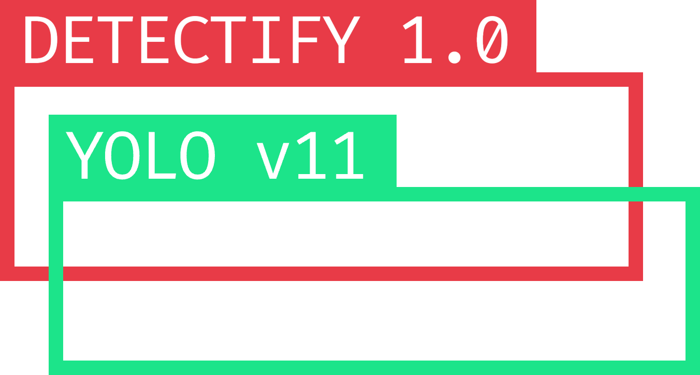

 

 

Detectify는 YOLO를 쉽고 빠르게 사용하기 위한, 라이브러리입니다. 

문제가 발생하거나, 질문이 있으시면, [Issue](https://github.com/BackGwa/Detectify/issues)를 남겨주세요. 최대한 도움을 드리겠습니다! 

해당 레포지토리 및 프로젝트에 기여를 하고싶다면, Fork해서 Pull-Request를 올려주세요! 
또한, 해당 프로젝트가 더 나아질 수 있도록, [토론](https://github.com/BackGwa/Detectify/discussions)을 시작할 수도 있습니다!

 

